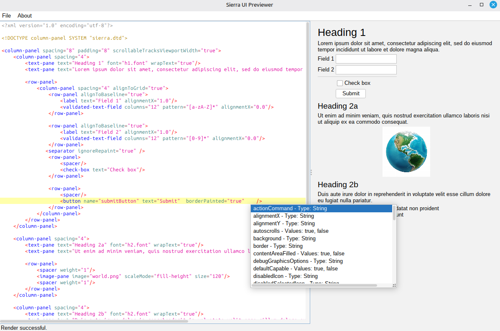

### Attention: This application is now part of the Sierra project at [https://github.com/HTTP-RPC/Sierra](https://github.com/HTTP-RPC/Sierra)

---

## sierra_previewer

## Introduction
Sierra is an open-source framework for simplifying development of Java Swing applications.

The Sierra project is located at [https://github.com/HTTP-RPC/Sierra](https://github.com/HTTP-RPC/Sierra)

This project aims to provide a live editor for XML files that Sierra uses to lay out Swing UIs.
You should be able to quickly assemble a UI by editing an XML file in the left pane and see the resultiing UI in the right pane.

This project is currently under heavy development so no release is provided.

However it is a standard maven project so please run the following after download 
```shell
mvn clean package
``` 

You will find an executable jar in the target folder and you can run it with 
```shell
java -jar sierra-ui-previewer-executable.jar
```

Note that Sierra and therefore this project require Java 21 or later.





